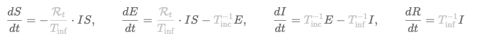

# Build-Your-Own COVID-19 SEIRD Epidemic Model
## By Ayden Salazar
### Inspired by a COVID-19 project done for the Data Science Society at Berkeley

Background: What is an SEIRD model?

SEIRD (which stands for **Susceptible** → **Exposed** → **Infected** → **Removed**) is a popular infectious disease model which relies upon four differential equations that correspond to the four stages of a disease’s progression. The equations are listed below:



Source: http://gabgoh.github.io/COVID/index.html

How to get started: 

1. To get started with the application, clone the repository via your terminal:

``` git clone https://github.com/aydensalazar/covid19seirdproject.git ```

2. Next, run the main.py file:

``` python3 main.py ```

3. You will be greeted with the dashboard. Feel free to customize the dynamic settings to simulate your own COVID-19 epidemic. Click "Generate Graph" to deploy your scenario. 


