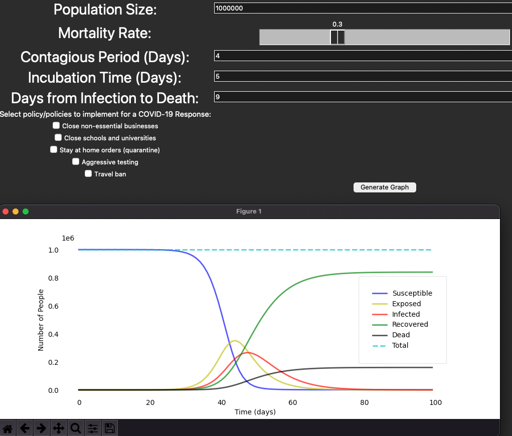

# Build-Your-Own COVID-19 SEIRD Epidemic Model
## By Ayden Salazar
### Inspired by a COVID-19 project done for the Data Science Society at Berkeley

To get started with the application, clone the repository via your terminal:

``` git clone https://github.com/aydensalazar/covid19seirdproject.git ```

Next, run the main.py file:

``` python3 main.py ```

You will be greeted with the dashboard. Feel free to customize the dynamic settings to simulate your own COVID-19 epidemic. Click "Generate Graph" to deploy your scenario. 




